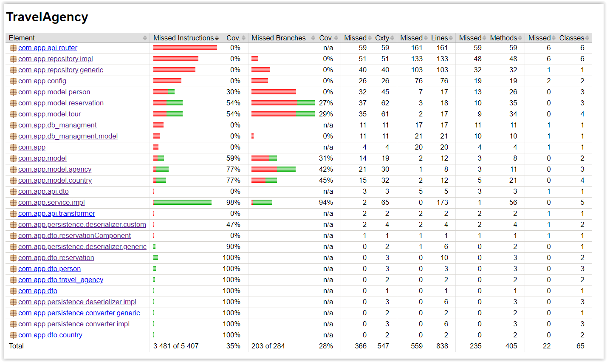

# Travel Agency


The project consists of integrating data from a text file and a database in a Java application. Here is a brief
description of what it does:
Loading data from a text file: Information about travel agencies is retrieved from a text file, including their unique
identification numbers, names, and locations of headquarters.
Loading data from a database: Information about trips is retrieved from a database, including a unique trip number,
travel destination, price, number of participants, and the ID of the travel agency that organized it.
The database initialization data can be retrieved from .json files

## Technologies and libraries used

* Java
* Spring
* Maven
* Lombok
* JUnit
* AssertJ
* Mockito
* MySQL

Testing Endpoints in Postman

          https://documenter.getpostman.com/view/25668358/2sAXjNYB7E


## Jacoco Coverage



## Required files
Files are necessary to replenish db if is empty

* Travel Agencies file json with pattern:

        id: 1,
        name: "name of agency",
        "city": "city where agency is",
        "phoneNumber": "+48 123 456 789"
* Countries file json with pattern:
  
      "countries": [
      {
      "id": 1,
      "name": "Poland"
      }]
* Tours file json with pattern:

      "tours": [
      {
      "id": 1,
      "agencyId": 1,
      "countryId": 1,
      "pricePerPerson": 2500,
      "startDate": "2024-09-01",
      "endDate": "2024-09-10"
      }
## Install via Docker

```bash
      docker pull szutek90/web-app
      docker-compose up -d --build
```
Test Endpoints

## Description

### Country Service:

Is a service in the application that takes care of adding new countries to the database. Its main task is:

Checking if the country already exists: Before adding a new country to the database, it checks if a country with the given name already exists in the repository.
Adding a new country: If the country does not exist, it saves the new country in the database.

If the country already exists, the class throws an exception to prevent duplicates.

### Person Service:

is a service that manages operations related to people in the application. The main functions of this class include:

* Adding a new person:
Checks if a person with the given email address already exists in the database.
If it does not exist, it creates a new Person object from the data in PersonDto and stores it in the database.
If the person already exists, it throws an exception.


* Updating an email address:
Allows changing the email address of an existing person by manipulating the email field through reflection.
Searching for a person by ID:
Returns a person based on their unique ID.
If the person with the given ID does not exist, it throws an exception.


* Searching for a person by name and surname:
Returns a person based on the given name and surname.
If the person with the given data does not exist, it throws an exception.

### Reservation with tour person agency service:

is a service in the application that manages operations related to tour bookings. Here is a brief description of what this class does:

* Adding a booking:
Checks if the tour and the person for whom the booking is to be made exist in the database.
If so, it creates a new booking and saves it to the database.
Otherwise, it throws an exception indicating that the resource is not available.

* Deleting a booking:
Deletes a booking from the database based on its ID.

* Finding the travel agency with the most organized tours:
Searches all bookings and groups them by travel agencies.
Finds the agency that organized the most tours.

* Finding the travel agency that made the most money:
Calculates the total revenue of each agency from booked tours and returns the agency that made the most money.

* Finding the most visited countries:
Groups all bookings by the countries to which the tours are organized and returns the most visited countries.

* Travel Agency Summary by Average Price of Trips:
Calculates the average price of trips for each travel agency.
For each agency, returns the trip that is closest to this average price.

* Searching for trips that take place in specific countries:
Returns a list of trips that take place in the specified countries.
The class manages various operations related to reservations, trips, people, travel agencies, and countries, combining data from different repositories.

### Tour with country service:
is a service in the application that manages operations related to tours. Here is a brief description of its functionality:

* Getting a tour by ID:
Returns a tour based on its unique identifier.
If the tour with the given ID does not exist, throws an exception.

* Getting tours by country:
Returns a list of tours that are in the given country.

* Getting tours within a price range:
Returns a list of tours that are within the given price range.

* Getting tours that are cheaper than a given price:
Returns a list of tours that are less than a given value.

* Getting tours that are more than a given price:
Returns a list of tours that are more than a given value.

* Getting tours within a given date range:
Returns a list of tours that are in the given date range.

* Getting tours by start date:
Returns a list of tours that are after a given date.

* Getting tours before a given date:
Returns a list of tours that were before a given date.

* Creating a new tour:
Checks if the country the tour belongs to exists in the database.
If the country exists, it creates a new tour based on the data from TourDto and saves it to the database.

In summary, the TourWithCountryServiceImpl class supports various operations related to managing tours, including searching for tours by various criteria and creating new tours.

### Travel agency service:
is a service that manages operations related to travel agencies. Here is a brief description of its functions:

* Getting a travel agency by ID:
Returns a travel agency by its unique ID.
If the agency with the given ID does not exist, throws a NoSuchElementException.

* Getting a travel agency by name:
Returns a travel agency by its name.
If the agency with the given name does not exist, throws a NoSuchElementException.

* Getting all travel agencies in a given city:
Returns a list of travel agencies located in the specified city.

* Adding a new travel agency:
Checks if an agency with the given name already exists in the database.
If it does not exist, creates a new travel agency and saves it in the database.
When adding a new agency, sets its unique ID to the largest existing ID plus 1.

* Private method getLastFreeId:
Gets the last used travel agency ID and returns the ID one greater that will be used for the new agency.

In summary, TravelAgencyServiceImpl supports various operations related to managing travel agencies, including adding, searching and downloading them according to various criteria.